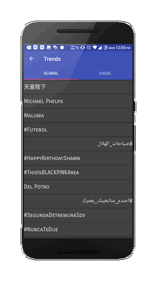
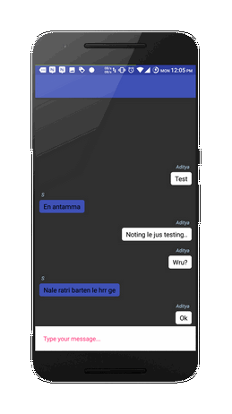
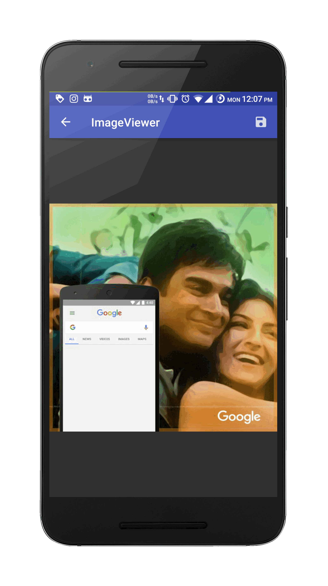
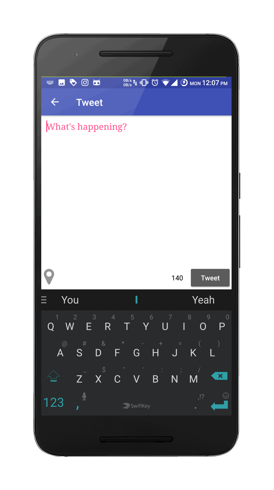
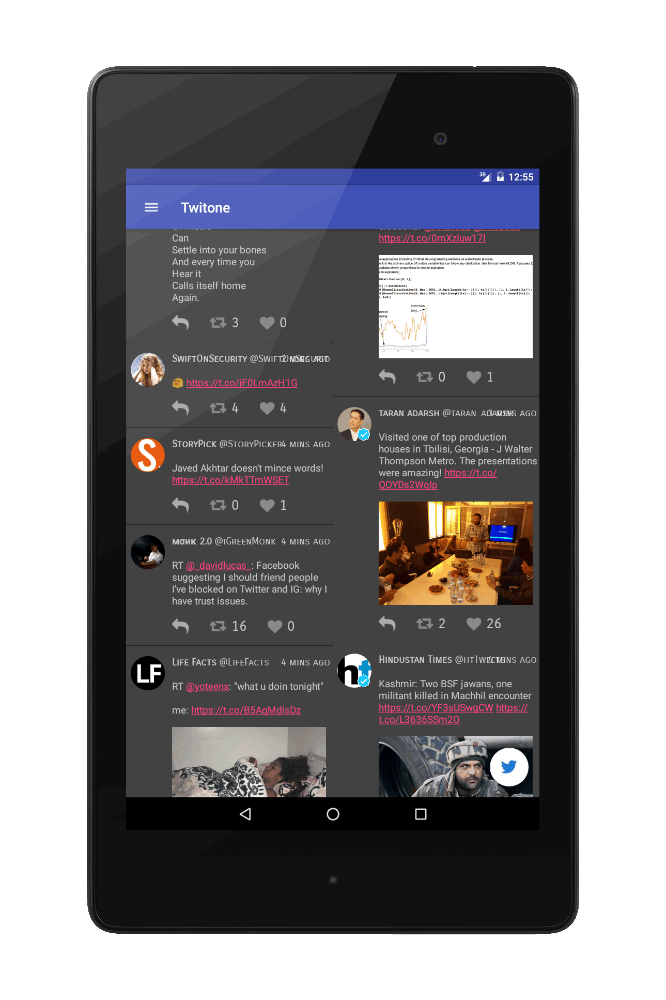
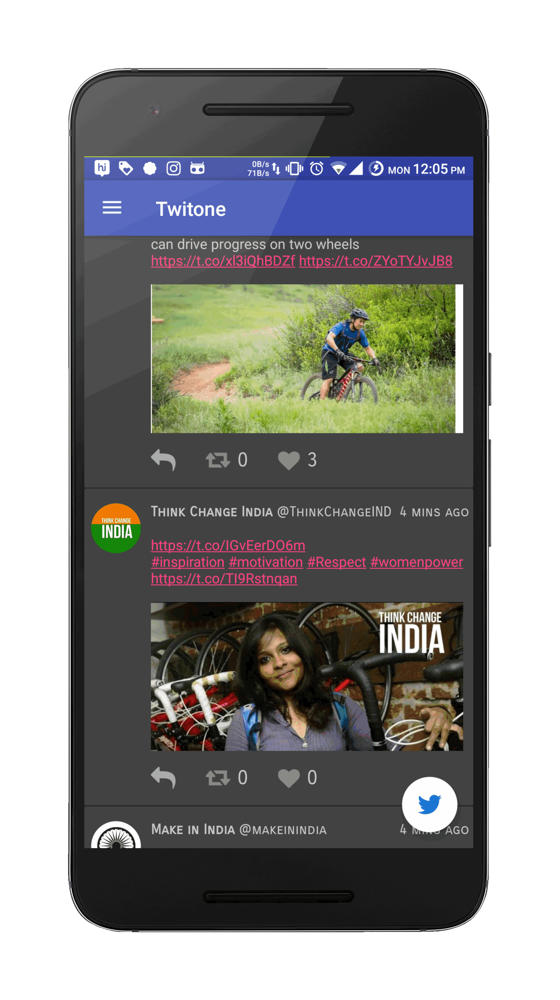
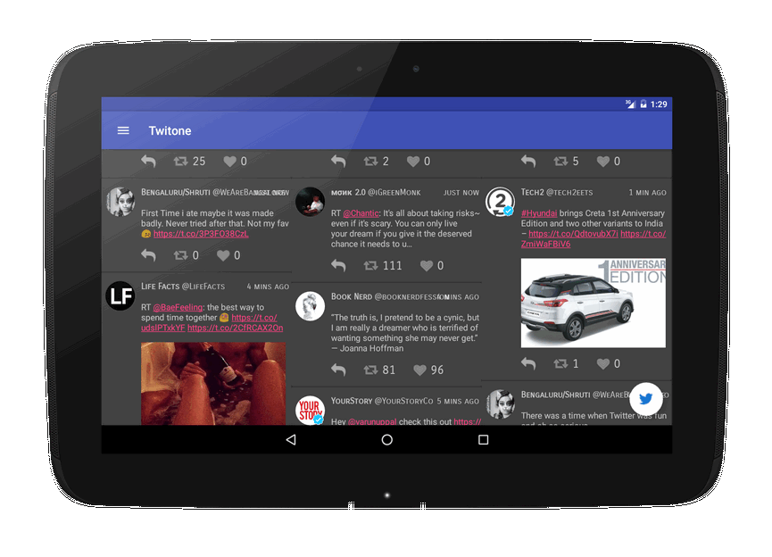

# Twitone 

## A light Twitter Client for Android

### Software Archeticture

1. Model View Presenter(MVP) - Presenter is used to Abstract the functionality that the individual component of the app provides
2. Repository Pattern - A local and remote data repository are used to get and store data. Provides a way to abstract and encapsulate functionality and caching.

----------------------------------------------------------------------------------------------------

###Libraries used

1.  StorIO
2.  Dagger 2
3.  RxJava & RxAndroid
4.  Twitter4j
5.  ButterKnife
6.  LeakCanary
7.  Material Progress Bar
8.  Material Drawer
9.  FontAwesome
10. Glide
11. Circular Image view
12. Sub-sampling ImageView
13. Stetho
14. AutoValue
15. AutoParcle
16. Espresso
17. Google Play Services - Location and Analytics

----------------------------------------------------------------------------------------------------

